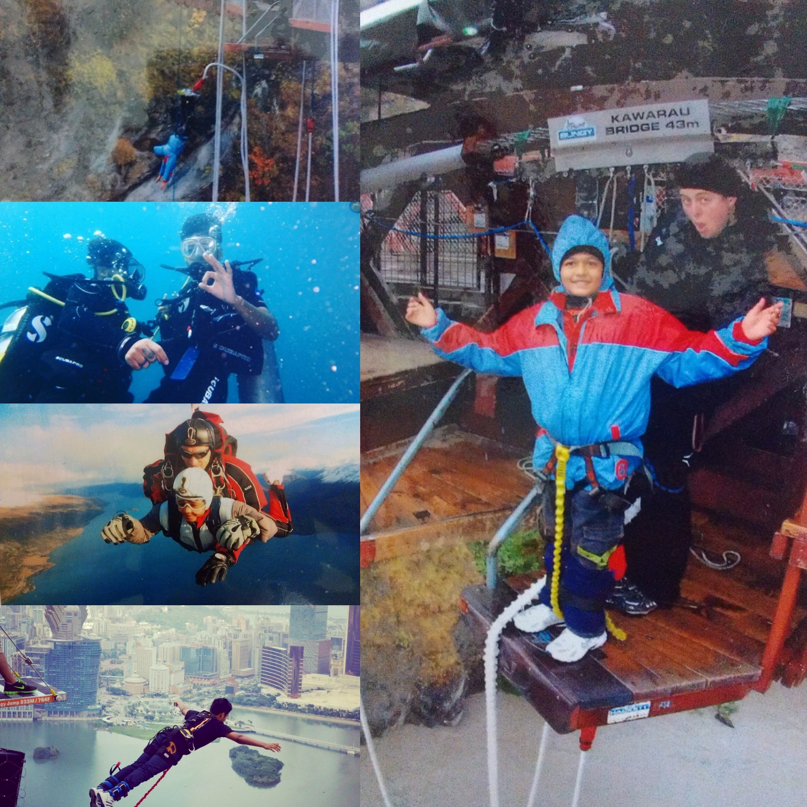

It just took 3 posts to get to the most common topic when it comes to blogging. Yes, it's about traveling. Like other travel bloggers, I'll be endorsing some of the products I have used during my trips. I will definitely recommend buying a GoPro since it doesn't get damaged when it is strapped to your forehead and you get thrown off a raft, into a summersault, and straight into the freezing water of the Ganges. Use the link given below for a 20% discount…...I'm kidding. There are no links here, just thoughts and experiences.

While growing up trips were planned mostly during summer breaks because that’s when my parents could take some time off work. The reason I looked forward to the summer break was different. The only thing I wanted to do was play cricket all day long and would not have to worry about going to school or completing homework. That is why I hated traveling during the summers. Being in school I wasn’t able to understand how important it was for my parents to take a break from their monotonous routine. As I grew older, I realised how important it was to burst my bubble and visit new places.

Stuck at home, in the middle of a pandemic, when I look back at all of the trips I have made, I have realised that I learnt a bunch of stuff that has helped me deal with situations in daily life.

### Lesson 1

> **Learn to accept**

Every place has it's own culture, beliefs, and way of life. Just because their beliefs differ from ours, it doesn't make them wrong. Traveling to different places has taught me to accept this difference. Can't expect people from a quaint town in the UK to have the same way of life as people in the busy streets of Bangkok. It doesn't mean that either one is doing something wrong. It's only when you visit these places that you realise that each one of them is happy and comfortable in their own way. I realised this during my trip to New Zealand. Every other person there was extremely polite, non-judgemental, and always ready to help. I came across locals in Auckland and Queenstown who were happy to talk about their families, know more about Indian culture, share food, talk about their visit to India etc. It is this behaviour which makes outsiders comfortable in a new country. The only reason I feel it is important to understand this in these current times is because of the toxic trend going around on all social media platforms. With the liberty that social media platforms provide, the intolerance towards people with opposing views and beliefs has increased. All of us are so quick to judge, criticise, and tear each other apart, that we don't spend even a moment of time to understand each other. Well, it may seem like a rant, but it's isn't one. It's only a collection of things I have learnt through travelling. It does get better.

### Lesson 2

> **Just Do It**

With so much uncertainty around, getting the opportunity to visit a new place seems like a privilege. Hand in hand with travel goes adventure. During most of my trips, I have always been excited to try new things. From food to new activities, all of it is an adventure in itself. It's not every day that an opportunity to jump off a plane, or to dive into clear waters to look at corals, or to try Turkish food right in the middle of Istanbul presents itself. It was after my trip to South Africa where I missed getting up close with a pride of lions because I was too lazy to wake up at 5 am for the wildlife safari. When I think about it now, I feel happy and content for getting the experiences when I could (with very few regrets), not knowing when that opportunity would present itself again.

### Lesson 3
> **Talk to everyone**

Here is something I regret not doing. I could never get myself to start a conversation with a random stranger in a different country. My father could do it easily and I watched him do it numerous times. He could easily start a conversation with locals, tour guides, or a random person sitting next to him on a bus. Within minutes, he was able to build a connection which made people feel comfortable. While walking around the streets of Newcastle, looking for a restaurant, we lost our way. Just like anyone else would do, we asked people for directions. A local guy stopped to help us and gave us the directions. As I starting walking ahead, I saw my father trying to start a conversation with him. Since he was brown, the first question my dad asked was if he was Indian. It took only a couple of question to get him talking about how he moved there to pursue further education and wanted to get his wife and daughter there as well. He also told us about some of the local pubs around our hotel and the areas to avoid after sunset. As I saw to my father start a conversation with these strangers, I realised how easily they shared things about their family, lifestyle, work, etc. Each one of them had a story to tell.

I might have a few more of these after I visit new places when the pandemic ends. Until then, stay safe!
